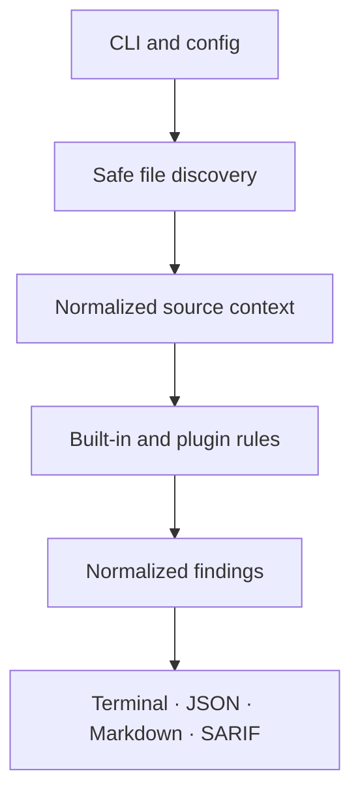

# AgentGuard

Static security scanner for AI agent applications, in Python and JavaScript/TypeScript.
It looks for committed credentials, prompt-injection paths, unsafe command execution,
excessive tool permissions, unrestricted file access, risky outbound calls, missing tool
validation, missing approval gates, and unpinned dependencies.

Offline. Never executes the code it scans. Designed to be run on repositories you have
not read.

```bash
pipx install agentguard-sast
agentguard scan ./project
```

## How well does it work?

Measured against a labelled corpus in this repository. Reproduce it with `make bench`:

```
| Rule  |  TP |  FP |  FN | Precision | Recall |
|-------|----:|----:|----:|----------:|-------:|
| AG001 |   4 |   0 |   0 |    100.0% | 100.0% |
| AG002 |   2 |   0 |   0 |    100.0% | 100.0% |
| AG003 |   1 |   0 |   0 |    100.0% | 100.0% |
| AG004 |   1 |   0 |   0 |    100.0% | 100.0% |
| AG005 |   2 |   0 |   0 |    100.0% | 100.0% |
| AG006 |   1 |   0 |   0 |    100.0% | 100.0% |
| AG007 |   1 |   0 |   0 |    100.0% | 100.0% |
| AG008 |   1 |   1 |   0 |     50.0% | 100.0% |
| AG010 |   1 |   0 |   0 |    100.0% | 100.0% |
| **all** |  14 |   1 |   0 |     93.3% | 100.0% |
```

**93.3% precision and 100% recall over 34 labelled files** — 13 true positives and 21 true
negatives, each carrying a written reason for its label in `tests/corpus/manifest.yml`.
That is the only accuracy figure this project publishes, because it is the only one it can
reproduce.

The single false positive is AG008, described below.

The corpus is small. Most of its true negatives were drawn from false positives observed on
real projects; the rest were written deliberately to cover awkward cases — a credential in a
docstring, `eval` on a literal, `subprocess` with a fixed argument vector, a `.env` full of
shell interpolation.

**This figure is a regression gate, not a precision estimate.** It says known defects stay
fixed on 34 files chosen partly because they once broke. It is not a prediction about your
repository, and it would be dishonest to read it as one — a corpus this size cannot support
that claim, and a corpus whose negatives were selected from observed failures is biased
towards passing by construction.

There is also a [labelled dataset](datasets/field-2026-07-29/) of 73 findings from five
real agent projects. It is **not** an accuracy claim: it is not reproducible from this
repository, and its labels carry a bias documented in that directory — the same reader
labelled them twice and disagreed with himself on a quarter of them, always in the same
direction. It ships so the labels can be argued with.

## Known limitations

Read these before deciding whether to run it.

- **AG008 has a known false positive**, at 50% precision on the corpus. It cannot tell a
  tool deleting a caller-supplied path from a function deleting a temp file it created
  itself; that needs data flow it does not have. Recorded as a strict `xfail` so it
  cannot be quietly closed. See [docs/DECISIONS.md](docs/DECISIONS.md).
- **Rules have been narrowed to remove false positives, losing recall in the process.**
  AG003 no longer flags `function_map` at all; AG005 no longer matches `file_path="/"`;
  AG006 no longer flags a call merely because its argument is named `url`; AG007 no longer
  matches a JS tool registered via a plain `function(`; AG002 no longer flags `eval` or
  `exec` over a literal or a module-level constant. Every trade and its reasoning is in
  [docs/DECISIONS.md](docs/DECISIONS.md).
- **Findings in `tests/`, `examples/`, `docs/`, and vendored paths are downgraded or
  suppressed.** A real credential committed under `tests/` reports at Medium and will not
  fail your build. This is deliberate — fixtures were the largest false-positive source
  measured — but it is a real blind spot if your layout is unusual.
- **AG004's pattern is quadratic, bounded at 4096 characters per line — not linear.**
  Rewriting it took a 28 KB single line from 34 seconds to 32 milliseconds, but the curve
  is still roughly 4× per doubling, so the safety comes from the cap rather than the
  rewrite. AG001 opts out of the cap in order to read minified bundles whole, and is held
  linear by `python -m tools.measure_linearity --check` in CI.
- **JavaScript and TypeScript are analysed lexically**, not with a full parser. Python
  gets an AST; JS/TS gets regexes over comment- and string-aware regions.
- **No dependency vulnerability scanning.** AG009 was deleted; use `pip-audit`,
  `osv-scanner`, or Dependabot. See [#16](https://github.com/amic25/agentguard/issues/16).
- **Unverified:** Windows and macOS. Every test run has been Linux. SARIF is schema-valid
  and confirmed to render in GitHub code scanning; nothing else is confirmed.

A clean scan is not a certification. It means these rules found nothing.

## Why AgentGuard?

Agent applications combine untrusted natural-language input with credentials, tools, network access, and side effects. Traditional secret scanners and dependency audits each cover one slice; AgentGuard evaluates the agent-specific trust boundaries between them.

| What it checks | Examples | Rule |
|---|---|---|
| Secrets | OpenAI/AWS/GitHub keys, private keys, assigned credentials, `.env` values | `AG001` |
| Code execution | `eval`, `os.system`, shell subprocesses, Node child processes | `AG002` |
| Tool permissions | broad LangChain/CrewAI tools, dangerous flags, MCP wildcards | `AG003` |
| Prompt injection | untrusted web, document, request, or tool output in instructions | `AG004` |
| File access | user-controlled paths and broad filesystem roots | `AG005` |
| External APIs | plaintext HTTP, and requests taking a named untrusted source | `AG006` |
| Input validation | tools without strict typed or JSON schemas | `AG007` |
| Agent privileges | consequential actions without approval gates | `AG008` |
| Dependencies | unpinned requirements | `AG010` |

The rules were written against patterns from LangChain, CrewAI, AutoGen, OpenAI Agents, and MCP clients and servers, and inspect behaviour rather than requiring one SDK version. Coverage of any given framework is whatever the corpus demonstrates — see `tests/corpus/`.

## Install

AgentGuard requires Python 3.10 or newer.

```bash
# Isolated CLI installation (recommended)
pipx install agentguard-sast

# Or with pip
python -m pip install agentguard-sast

# From source
git clone https://github.com/amic25/agentguard.git
cd agentguard
python -m pip install -e .
```

Docker users can run without installing Python dependencies locally:

```bash
docker build -t agentguard .
docker run --rm -v "$PWD:/workspace:ro" agentguard scan /workspace
```

## Use

Scan the current project and fail when a High or Critical issue is found:

```bash
agentguard scan .
```

Generate machine-readable or reviewable reports:

```bash
agentguard scan . --format sarif --output agentguard.sarif
agentguard scan . --format json --output agentguard.json --fail-on medium
agentguard scan . --format markdown --output security-report.md --fail-on none
```

Other useful commands:

```bash
agentguard rules                 # list built-in rules
agentguard init                  # create .agentguard.yml
agentguard scan src --exclude generated/**
```

Exit codes are stable for automation:

| Code | Meaning |
|---|---|
| `0` | Every enabled rule ran to completion over every in-scope file, and nothing reached the `--fail-on` threshold. |
| `1` | The scan completed and found at least one finding at or above `--fail-on`. |
| `2` | The scan did not complete — a rule raised, a file could not be read, or the invocation was invalid. **Findings are not a clean bill of health.** |

`2` outranks `1`: automation must be able to tell "found problems" from "the tool broke". A scan
that cannot examine a file never reports that file as clean. Files skipped by declared policy
(`max_file_size_kb`) are counted in the report and do not affect the exit code.

### GitHub code scanning

```yaml
- name: Scan AI agent security
  run: agentguard scan . --format sarif --output agentguard.sarif --fail-on none
- name: Upload SARIF
  uses: github/codeql-action/upload-sarif@v3
  with:
    sarif_file: agentguard.sarif
```

### Configure and suppress

Create `.agentguard.yml`:

```yaml
exclude:
  - generated/**
max_file_size_kb: 1024
max_line_length: 4096
follow_symlinks: false
```

A config file discovered inside the repository being scanned is **untrusted input** — AgentGuard is
built to run on code you have not read. Such a file may only make a scan stricter: exclusions are
added to the defaults, `max_file_size_kb` and `max_line_length` may only be lowered, and
`follow_symlinks` may only be turned off.

`plugins`, `disabled_rules`, and `severity_overrides` can execute code or weaken a scan, so they are
rejected in a discovered config. To use them, vouch for the file explicitly — this is the operator
saying "I have read this":

```bash
agentguard scan . --config .agentguard.yml
```

```yaml
# only honoured via --config
disabled_rules:
  - AG010
severity_overrides:
  AG006: high
plugins:
  - company_agent_rules
```

See [Security model](docs/SECURITY_MODEL.md#configuration-trust-boundary) for the full boundary.

### Test, example, and documentation paths

Files under `tests/`, `examples/`, `docs/`, `fixtures/`, and similar are treated as
fixtures. Credential findings there are reported at `Medium` with `low` confidence rather
than `Critical` — credentials genuinely do get committed to test fixtures, so they are not
hidden, but they no longer block the default `--fail-on high` gate. Every other rule is
suppressed on those paths, because a `delete_file` call in an example is a demonstration.

A rule declares this for itself via `fixture_policy`; see [Plugin authoring](docs/PLUGINS.md#declaring-context).

### Suppressions

Suppress a reviewed false positive on the affected or previous line. Suppressions should explain the compensating control in code review.

```python
# URL is selected from a compile-time allowlist. agentguard: ignore[AG006]
response = requests.get(url, timeout=5)
```

## Reports

Every finding includes severity (`Critical`, `High`, `Medium`, or `Low`), stable rule ID, affected file/line/column, explanation, concrete risk, confidence, and remediation. Terminal output is optimized for humans; JSON has a versioned schema; Markdown is designed for security reviews; SARIF 2.1.0 integrates with GitHub code scanning.

## Plugins

Custom rules can be loaded from a module named in an operator-supplied config (`--config`), or distributed as a Python package with an `agentguard.rules` entry point. Plugins execute inside the scanner process, so they are never loaded from a config discovered in the repository under scan. The API uses the same stable `Rule`, `RuleMetadata`, `SourceFile`, and `Finding` objects as built-ins.

See [Plugin authoring](docs/PLUGINS.md) for a complete example and packaging instructions.

## Architecture



Rules never execute the target project. AgentGuard decodes supported text files, optionally builds a Python AST, and applies deterministic checks. See [Architecture](docs/ARCHITECTURE.md) and [Security model](docs/SECURITY_MODEL.md).

## Development

```bash
git clone https://github.com/amic25/agentguard.git
cd agentguard
python -m venv .venv
source .venv/bin/activate
python -m pip install -e '.[dev]'
make check
```

Contributions are welcome, and a report that a finding is wrong is the most useful kind —
see [SUPPORT.md](SUPPORT.md). Start with [CONTRIBUTING.md](CONTRIBUTING.md) or the
[good first issues](docs/GOOD_FIRST_ISSUES.md). Security reports follow
[SECURITY.md](SECURITY.md), not a public issue.

Reference: [decisions and their costs](docs/DECISIONS.md) ·
[rule identifier policy](docs/RULE_IDS.md) · [CI configuration notes](docs/CI_SETUP.md)

## Roadmap

- Data flow sufficient to close AG008's known false positive
- Corpus coverage for AG003 and AG006, which the current corpus under-tests
- Dependency scanning delegated to pip-audit/osv-scanner, normalised into one report ([#16](https://github.com/amic25/agentguard/issues/16))
- Baseline/suppression file so the tool can be adopted on a repository that is already dirty

Details and acceptance criteria live in [ROADMAP.md](ROADMAP.md).

## Responsible use and limitations

AgentGuard is a defense-in-depth static analysis tool. It does not prove an agent is safe, replace threat modeling or runtime sandboxing, or execute target code. Heuristics can miss obfuscated or dynamically constructed behavior and can produce false positives. Review findings in context and combine AgentGuard with secret scanning, dependency auditing, least-privilege runtime controls, monitoring, and human approval for high-impact actions.

## License

Apache License 2.0. See [LICENSE](LICENSE). By contributing, you agree that your contributions are licensed under the same terms.
